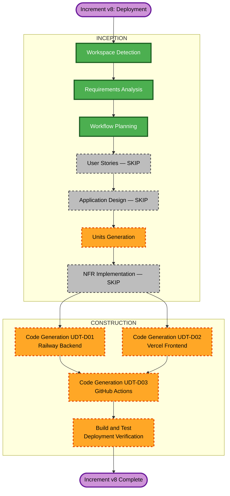

# Execution Plan — Increment v8: Deployment

## Detailed Analysis Summary

### Transformation Scope
- **Transformation Type**: Infrastructure — adding deployment configuration to an existing, fully-built application
- **Primary Changes**: Railway deployment config, Vercel frontend config, GitHub Actions CI/CD pipeline
- **Related Components**: `Dockerfile` (runner CMD fix), `frontend/next.config.mjs` (no change needed), `src/main.ts` (already PORT-env-aware)

### Change Impact Assessment
- **User-facing changes**: No — deployment infra only, zero UI changes
- **Structural changes**: No — no new modules, services, or architectural components
- **Data model changes**: No — no schema modifications
- **API changes**: No — all endpoints remain the same
- **NFR impact**: Yes (positive) — HTTPS enforced via platform, CI/CD gates quality, Railway Postgres provides managed backups

### Component Relationships
```
## Component Relationships
- Primary Component:     Dockerfile (runner stage CMD fix)
- Infrastructure Files:  railway.json, frontend/vercel.json, .github/workflows/ci-cd.yml
- Shared:                .env.example, frontend/.env.production.example
- Dependent:             GitHub Actions deploys both Railway and Vercel services
- Supporting:            Railway Postgres plugin (managed, no code change needed)
```

| Component      | Change Type        | Change Reason                              | Priority |
|----------------|--------------------|--------------------------------------------|----------|
| Dockerfile     | Minor (CMD)        | Need prisma migrate deploy before start    | Critical |
| railway.json   | New file           | Railway service config (healthcheck, port) | Critical |
| vercel.json    | New file           | Vercel build & framework config            | Critical |
| ci-cd.yml      | New file           | GitHub Actions pipeline for both platforms | Critical |
| .env.example   | New file           | Document required backend env vars         | Important |
| .env.prod.example | New file        | Document required frontend env vars        | Important |

### Risk Assessment
- **Risk Level**: Low
- **Rollback Complexity**: Easy — all changes are new files + 1 line in Dockerfile; revert by removing files
- **Testing Complexity**: Simple — configuration files, static validation

---

## Phase Determination

### User Stories
- **Decision**: SKIP
- **Reason**: No user-facing features. Pure deployment infrastructure.

### Application Design
- **Decision**: SKIP
- **Reason**: No new components, methods, or architectural changes.

### Units Planning / Generation
- **Decision**: EXECUTE (simplified — units already determined from requirements Q1–Q7)
- **Reason**: 3 deployment UDTs need definition and sequencing

### NFR Implementation
- **Decision**: SKIP
- **Reason**: NFRs handled by platform (Railway provides HTTPS, auto-scaling, managed DB backups; Vercel provides CDN + HTTPS automatically)

### Code Generation
- **Decision**: EXECUTE — 3 UDTs
- **Build and Test artifact**: EXECUTE — deployment verification instructions

---

## Module Update Strategy

```markdown
## Module Update Strategy
- Update Approach: Sequential with partial parallelism
- Critical Path: D01 + D02 (independent) → D03 (references both)
- Coordination Points: D03 GitHub Actions workflow references Railway + Vercel tokens and services defined in D01 and D02
- Testing Checkpoints: After D01 validate Dockerfile builds; after D02 validate vercel.json; D03 tested end-to-end via first pipeline run
```

### Sequencing
```
D01 (Railway Backend)  ──┐
                          ├──► D03 (GitHub Actions CI/CD)
D02 (Vercel Frontend)  ──┘
```
D01 and D02 are independent — D03 requires both to be complete as it deploys both.

---

## Units of Work

### UDT-D01: Railway Backend Configuration
**Goal**: Configure NestJS backend for production deployment on Railway
**Files**:
- `Dockerfile` — Fix runner CMD: add `npx prisma migrate deploy &&` before `node dist/main.js`
- `railway.json` — Railway service config: healthcheck path, restart policy, region
- `.env.example` — Document all required backend environment variables

**Railway environment variables** (set in Railway dashboard, NOT in repo):
- `DATABASE_URL` — Provided automatically by Railway Postgres plugin
- `JWT_SECRET` — Must be set manually (strong random string)
- `PORT` — Set to `3000` (or Railway provides it automatically)
- `NODE_ENV` — Set to `production`
- `UPLOAD_DIR` — Set to `/app/uploads`

---

### UDT-D02: Vercel Frontend Configuration
**Goal**: Configure Next.js frontend for production deployment on Vercel
**Files**:
- `frontend/vercel.json` — Vercel project config: framework, build command, output directory
- `frontend/.env.production.example` — Document required frontend environment variables

**Vercel environment variables** (set in Vercel dashboard, NOT in repo):
- `NEXT_PUBLIC_API_URL` — Set to Railway backend URL (e.g. `https://app-dx.railway.app`)

**Note**: `api.ts` already reads `process.env.NEXT_PUBLIC_API_URL` — no code change needed.

---

### UDT-D03: GitHub Actions CI/CD Pipeline
**Goal**: Automate test → deploy on every push to `main`
**Files**:
- `.github/workflows/ci-cd.yml` — Full pipeline

**Pipeline Jobs**:
1. `test-backend` — Build Docker test stage, run `npm test`
2. `deploy-backend` — Railway CLI deploy (depends on test-backend)
3. `deploy-frontend` — Vercel CLI deploy (depends on test-backend, runs parallel with deploy-backend)

**Required GitHub Secrets**:
| Secret Name         | Description                                      |
|---------------------|--------------------------------------------------|
| `RAILWAY_TOKEN`     | Railway API token (from Railway dashboard)       |
| `VERCEL_TOKEN`      | Vercel API token (from Vercel dashboard)         |
| `VERCEL_ORG_ID`     | Vercel organization/team ID                      |
| `VERCEL_PROJECT_ID` | Vercel project ID for the frontend               |

---

## Workflow Visualization



---

## Execution Checklist

### INCEPTION
- [x] Workspace Detection
- [x] Requirements Analysis (Q1–Q7 answered)
- [x] Workflow Planning (this document)
- [ ] Units Generation (simplified — use plan above)

### CONSTRUCTION
- [ ] UDT-D01: Railway Backend Config
  - [ ] Fix Dockerfile runner CMD
  - [ ] Create railway.json
  - [ ] Create .env.example
- [ ] UDT-D02: Vercel Frontend Config
  - [ ] Create frontend/vercel.json
  - [ ] Create frontend/.env.production.example
- [ ] UDT-D03: GitHub Actions CI/CD
  - [ ] Create .github/workflows/ci-cd.yml
- [ ] Build and Test: Deployment Verification
